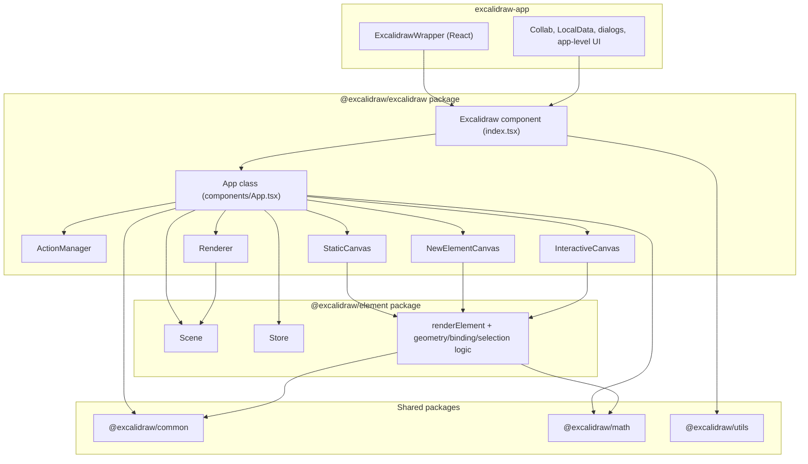
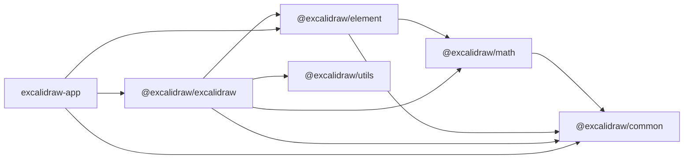

# Project Architecture

This document describes the architecture that is directly observable in the repository source code.

## High-level Architecture

### Monorepo structure

- The repository root `package.json` declares a Yarn workspace monorepo named `excalidraw-monorepo`.
- Workspace entries are:
  - `excalidraw-app`
  - `packages/*`
  - `examples/*`
- Core library packages in `packages/` are:
  - `@excalidraw/common`
  - `@excalidraw/math`
  - `@excalidraw/element`
  - `@excalidraw/excalidraw`
  - `@excalidraw/utils`

### Runtime layers (from code)

- `excalidraw-app/App.tsx` renders `<Excalidraw />` from `@excalidraw/excalidraw`.
- `packages/excalidraw/index.tsx` renders internal `<App />` from `packages/excalidraw/components/App.tsx`.
- `App` constructs and owns:
  - `Scene` (`@excalidraw/element`)
  - `Renderer` (`packages/excalidraw/scene/Renderer.ts`)
  - `Store` (`@excalidraw/element`)
  - `History` (`packages/excalidraw/history.ts`)
  - `ActionManager` (`packages/excalidraw/actions/manager.tsx`)
- Rendering is split across three canvases in `App.render()`:
  - `StaticCanvas` (scene content)
  - `NewElementCanvas` (preview of currently created element)
  - `InteractiveCanvas` (selection/UI overlays)

### High-level architecture diagram

### Build order visible in scripts

- Root scripts define `build:packages` as:
  - `build:common`
  - `build:math`
  - `build:element`
  - `build:excalidraw`
- This sequence matches declared package dependencies:
  - `math` depends on `common`
  - `element` depends on `common` and `math`
  - `excalidraw` depends on `common`, `element`, `math`

## Data Flow: how data moves through the system

### Main in-editor flow

1. User input is captured by `App` handlers (pointer, keyboard, wheel, clipboard, touch).
2. Handlers execute logic directly or trigger `ActionManager.executeAction()` / `ActionManager.handleKeyDown()`.
3. Action `perform()` returns an `ActionResult`:
   - `elements`
   - `appState`
   - `files`
   - `captureUpdate` (`IMMEDIATELY`, `NEVER`, `EVENTUALLY`)
4. `App.syncActionResult()` applies the result:
   - replaces scene elements through `scene.replaceAllElements(...)`
   - merges app state through `setState(...)`
   - updates files and image cache
   - schedules store action by `store.scheduleAction(actionResult.captureUpdate)`
5. On component update, `App` calls `store.commit(elementsMap, this.state)`.
6. `Store` emits:
   - durable increments for `IMMEDIATELY`
   - ephemeral increments for `NEVER` / `EVENTUALLY`
7. `History` subscribes to durable increments and records undo deltas.
8. `onChange` callbacks are fired (when `isLoading` is false).
9. Render path recomputes visible/renderable elements and updates all canvases.

### Data flow from external API calls

- Host app can call `ExcalidrawImperativeAPI.updateScene(...)`.
- `updateScene` can set:
  - elements
  - appState
  - collaborators
  - capture mode
- If `captureUpdate` is provided, `App.updateScene()` schedules a store micro action.
- Then it applies provided app state and/or elements to current runtime state.

### Initialization data flow

- `App.initializeScene()` loads `props.initialData` (function or promise).
- It restores:
  - elements via `restoreElements(...)`
  - app state via `restoreAppState(...)`
- It then calls `syncActionResult(...)` with `captureUpdate: CaptureUpdateAction.NEVER`.
- During startup, `componentDidMount()` wires listeners:
  - store durable increments -> history recording
  - scene updates -> rerender trigger
  - browser events (resize, hashchange, focus/blur, etc.)

### File and image flow

- Binary files are stored in `App.files`.
- `syncActionResult()` merges incoming files and refreshes image cache.
- `addNewImagesToImageCache()` populates `imageCache` for initialized image elements.
- If cache updates changed files, shape cache entries are invalidated and `scene.triggerUpdate()` runs.

### Collaboration-related flow at app layer

- `excalidraw-app/App.tsx` integrates collaboration around Excalidraw API:
  - scene initialization from collaboration links
  - remote image loading
  - collab start/stop
  - pointer updates passed through `onPointerUpdate`
- In editor runtime, collaborator state is stored in `appState.collaborators`.
- `InteractiveCanvas` reads collaborators and prepares:
  - remote pointer viewport coordinates
  - remote selected element IDs
  - remote pointer button/usernames/user states
- `renderInteractiveScene()` renders remote cursors and remote selection outlines.

## State Management

### Overview

- State is split across:
  - `App.state` (`AppState`) in `packages/excalidraw/types.ts`
  - `Scene` element collections in `packages/element/src/Scene.ts`
  - `Store` snapshots/deltas in `packages/element/src/store.ts`
  - `ActionManager` action registry and execution pipeline

### `appState` (UI + editor session state)

- `getDefaultAppState()` in `packages/excalidraw/appState.ts` initializes defaults.
- `AppState` includes:
  - tool state (`activeTool`, `preferredSelectionTool`, `penMode`)
  - scene view (`scrollX`, `scrollY`, `zoom`, `gridSize`, `gridModeEnabled`)
  - selection state (`selectedElementIds`, `selectedGroupIds`, `selectionElement`)
  - editing state (`editingTextElement`, `multiElement`, `resizingElement`)
  - frame state (`frameToHighlight`, `frameRendering`, `editingFrame`)
  - dialogs/menus (`openDialog`, `openMenu`, `openPopup`, `openSidebar`)
  - collaboration (`collaborators`, `userToFollow`, `followedBy`)
  - export settings (`exportScale`, `exportBackground`, `exportWithDarkMode`)
  - rendering helpers (`shouldCacheIgnoreZoom`, `hoveredElementIds`, `snapLines`)
- Storage/export filtering is configured by `APP_STATE_STORAGE_CONF` in `appState.ts`:
  - each key has flags for `browser`, `export`, `server`
  - helpers:
    - `clearAppStateForLocalStorage`
    - `cleanAppStateForExport`
    - `clearAppStateForDatabase`

### `elements` (scene model in `Scene`)

- `Scene` stores parallel collections:
  - all elements (including deleted)
  - non-deleted elements
  - maps for all/non-deleted
  - frame-like subsets
- `replaceAllElements(...)` is the primary synchronization point:
  - validates indices (throttled in dev/test/debug modes)
  - runs index synchronization
  - rebuilds maps/lists
  - triggers scene update (`sceneNonce` regeneration + callbacks)
- `Scene` also provides:
  - selected elements cache (`getSelectedElements(...)`)
  - element insertion APIs (`insertElementAtIndex`, `insertElements`)
  - mutable element updates (`mutateElement(...)`) with optional immediate update trigger

### `Store` and observed state snapshotting

- `Store` captures state transitions and emits increments.
- Three capture modes are implemented:
  - `IMMEDIATELY` -> durable increment + snapshot update
  - `NEVER` -> ephemeral increment + snapshot update
  - `EVENTUALLY` -> ephemeral increment without snapshot update
- `Store.commit(...)` executes:
  - queued micro actions
  - one scheduled macro action (priority: IMMEDIATELY > NEVER > EVENTUALLY)
- `StoreSnapshot` tracks:
  - `elements` snapshot (deep-copied for changed elements)
  - `observed appState` subset only
  - metadata (`didElementsChange`, `didAppStateChange`)
- Observed app state is narrowed by `getObservedAppState(...)` to:
  - `name`
  - `editingGroupId`
  - `viewBackgroundColor`
  - `selectedElementIds`
  - `selectedGroupIds`
  - `selectedLinearElement` (elementId, isEditing)
  - `croppingElementId`
  - `activeLockedId`
  - `lockedMultiSelections`

### `actionManager` (command/action layer)

- `ActionManager` holds `actions: Record<ActionName, Action>`.
- It is constructed with:
  - updater callback (`App.syncActionResult`)
  - `getAppState`
  - `getElementsIncludingDeleted`
  - `app` reference
- Responsibilities:
  - register single/all actions
  - keyboard shortcut resolution (`handleKeyDown`)
  - programmatic execution (`executeAction`)
  - action panel rendering (`renderAction`)
  - action availability checks (`isActionEnabled`)
- `App` registers:
  - all actions from the actions registry
  - undo/redo actions created from `History`
- Action result contract (`actions/types.ts`) is:
  - optional `elements`
  - optional `appState`
  - optional `files`
  - required `captureUpdate`
  - optional `replaceFiles`

### History integration

- `App.componentDidMount()` subscribes:
  - `store.onDurableIncrementEmitter` -> `history.record(increment.delta)`
- `History` keeps:
  - `undoStack`
  - `redoStack`
- Undo/redo:
  - applies inverse `HistoryDelta`
  - schedules store micro action with immediate capture for sync purposes
  - returns next elements + appState for editor application

## Rendering Pipeline: from React component to canvas

### Entry point in React render

- `App.render()` computes:
  - `sceneNonce` from `scene.getSceneNonce()`
  - `{ elementsMap, visibleElements }` from `renderer.getRenderableElements(...)`
  - `allElementsMap` from `scene.getNonDeletedElementsMap()`
- `App.render()` mounts:
  - `StaticCanvas`
  - optional `NewElementCanvas` (only when `appState.newElement` exists)
  - `InteractiveCanvas`

### Element filtering before rendering

- `Renderer.getRenderableElements(...)` performs:
  - fetch of non-deleted elements from scene
  - exclusion of current new element by ID
  - exclusion of text currently being edited
  - viewport culling via `isElementInViewport(...)`
- It returns:
  - `elementsMap` (renderable map)
  - `visibleElements` (subset in viewport)
- The function is memoized and can be cache-cleared in `Renderer.destroy()`.

### Static canvas pipeline

- `StaticCanvas` sets canvas pixel dimensions from app width/height and scale.
- It calls `renderStaticScene(...)` (optionally throttled).
- `renderStaticScene`:
  - bootstraps and clears the canvas
  - applies zoom transform
  - optionally paints grid
  - iterates visible elements (non-iframe first, iframe-like afterwards)
  - applies frame clipping when configured
  - delegates drawing to `renderElement(...)` from `@excalidraw/element`
  - renders bound text for container elements
  - renders link icons for linked elements
  - renders pending flowchart nodes

### New-element canvas pipeline

- `NewElementCanvas` is a dedicated overlay canvas for current `newElement`.
- `renderNewElementScene(...)`:
  - bootstraps a clean canvas
  - applies zoom
  - skips invisibly small elements
  - applies frame clipping if needed
  - renders only the current `newElement`

### Interactive canvas pipeline

- `InteractiveCanvas` renders a `<canvas class="interactive">` with event handlers.
- On updates, it prepares runtime render parameters:
  - collaborator pointer/selection maps
  - selection color from CSS variable
  - callback to `App.renderInteractiveSceneCallback(...)`
- It starts animation loop through `AnimationController.start(...)`.
- Each frame calls `renderInteractiveScene(...)`.
- `renderInteractiveScene` paints UI overlays:
  - selection rectangle
  - transform handles
  - linear editor points
  - binding highlights
  - frame highlights
  - search highlights
  - snap lines
  - remote cursors
  - optional scrollbars

### Core draw primitive (`renderElement`)

- Implemented in `packages/element/src/renderElement.ts`.
- Supports element types:
  - shape types (`rectangle`, `diamond`, `ellipse`, `line`, `arrow`)
  - content types (`text`, `image`)
  - container types (`frame`, `magicframe`, `iframe`, `embeddable`)
  - `freedraw`
- Uses `ShapeCache` and per-element canvas caching (`elementWithCanvasCache`) in non-export mode.
- Uses direct draw path for export mode.
- Applies opacity through `getRenderOpacity(...)`, including frame opacity and erasure states.

## Package Dependencies: relationships between packages

### Workspace aliases and source linking

- Root `tsconfig.json` defines paths:
  - `@excalidraw/common` -> `packages/common/src/index.ts`
  - `@excalidraw/math` -> `packages/math/src/index.ts`
  - `@excalidraw/element` -> `packages/element/src/index.ts`
  - `@excalidraw/excalidraw` -> `packages/excalidraw/index.tsx`
  - `@excalidraw/utils` -> `packages/utils/src/index.ts`
- `excalidraw-app/vite.config.mts` mirrors these aliases for runtime bundling.

### Declared internal dependencies by package

- `@excalidraw/common`:
  - no internal package dependencies
- `@excalidraw/math`:
  - depends on `@excalidraw/common`
- `@excalidraw/element`:
  - depends on `@excalidraw/common`
  - depends on `@excalidraw/math`
- `@excalidraw/excalidraw`:
  - depends on `@excalidraw/common`
  - depends on `@excalidraw/element`
  - depends on `@excalidraw/math`
- `@excalidraw/utils`:
  - independent package in `packages/` with its own dependency set
  - `@excalidraw/excalidraw/index.tsx` re-exports functions from `@excalidraw/utils/export`

### Dependency graph (package-level)

### Observable cross-package usage in code

- `packages/excalidraw/components/App.tsx` imports large API surfaces from:
  - `@excalidraw/common`
  - `@excalidraw/math`
  - `@excalidraw/element`
- `packages/excalidraw/renderer/*` modules combine:
  - render orchestration in `@excalidraw/excalidraw`
  - drawing primitives from `@excalidraw/element`
  - geometry/constants from `@excalidraw/math` and `@excalidraw/common`
- `excalidraw-app/App.tsx` imports:
  - main editor APIs/components from `@excalidraw/excalidraw`
  - constants/helpers from `@excalidraw/common`
  - element helpers/types from `@excalidraw/element`

### Exports surface relation

- `@excalidraw/excalidraw/index.tsx` re-exports:
  - editor component and hooks
  - many utilities from `@excalidraw/element`
  - constants/helpers from `@excalidraw/common`
  - export helpers from `@excalidraw/utils/export`
- This makes `@excalidraw/excalidraw` the primary integration surface for host apps.

